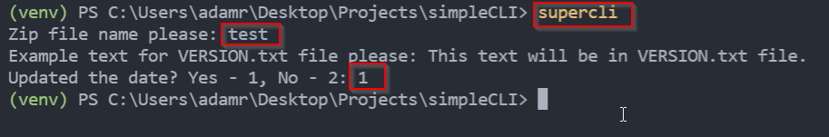

# Simple CLI in Python

## Description:
It's a simple CLI written in Python which allows to update example data in VERSION.txt and today's date in updated.txt file which are inside zip file.

## Technologies and libraries:
- Python 3.10.2
- click 8.0.4

## Installation:
##### 1. Clone repository:
```sh
$ git clone https://github.com/adm108/CarsRESTAPI.git
```
##### 2. Go to simpleCLI folder, create virtual enviroment and activate it:
```sh
$ cd simpleCLI
$ python -m venv venv (if you work on Windows system)
```
##### 3. Install app locally:
```sh
$ pip install --editable .
```
##### 3. Run again your terminal, activate virtual environment, write supercli command, enter some example data for VERSION.txt file, specify if you want to update the updated.txt file with current date, check resluts:
```sh
$ supercli
```


